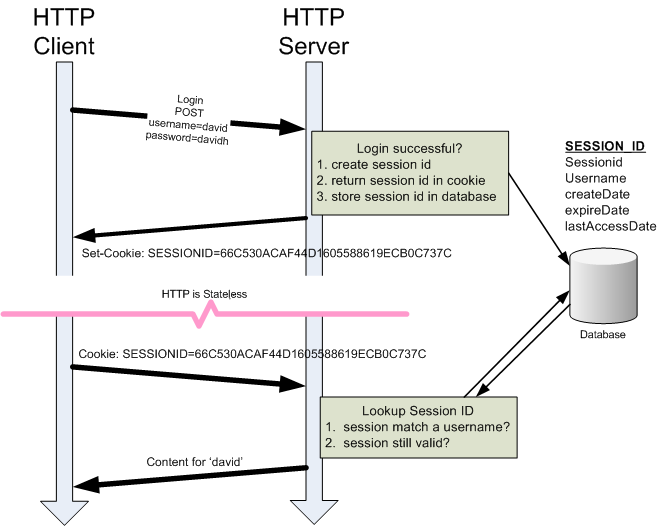

# Sessions und Cookies

## Das Problem: HTTP ist stateless

HTTP ist ein zustandsloses Protokoll. Jede Anfrage ist für den Server unabhängig — er weiß nicht, ob vorher schon eine Anfrage vom selben Client kam. Ohne zusätzliche Mechanismen gibt es kein "Angemeldet bleiben".

## Session Token / Session ID

Eine Session ID ist ein eindeutiger, zufällig generierter Schlüssel, der nach dem Login dem Client zugewiesen wird.

### Ablauf

1. Benutzer meldet sich an (Benutzername + Passwort)
2. Server prüft die Credentials
3. Server generiert eine lange, zufällige Session ID
4. Server speichert die Session ID serverseitig (Datenbank, In-Memory)
5. Session ID wird als Cookie an den Client gesendet
6. Bei jeder weiteren Anfrage sendet der Browser das Cookie automatisch mit
7. Server liest die Session ID, sucht die zugehörige Session und kennt dadurch den Benutzer

Die Session ID selbst enthält keine Benutzerdaten — sie ist nur ein Zeiger auf die Serverdaten.

## Cookies

Ein Cookie ist ein kleines Datenstück, das der Server dem Browser mitgibt und das der Browser bei jedem Request an dieselbe Domain automatisch zurücksendet.

### Wichtige Cookie-Attribute

| Attribut | Bedeutung |
|----------|-----------|
| `HttpOnly` | Cookie ist nur per HTTP erreichbar, nicht per JavaScript — schützt vor XSS |
| `Secure` | Cookie wird nur über HTTPS gesendet |
| `SameSite=Strict` | Cookie wird nicht bei Cross-Site-Requests mitgeschickt — schützt vor CSRF |
| `SameSite=Lax` | Cookie wird nur bei GET-Navigation mitgeschickt |
| `Expires` / `Max-Age` | Ablaufzeitpunkt — ohne dieses Attribut ist es ein Session-Cookie (wird beim Schließen des Browsers gelöscht) |

### Session-Cookie vs. Persistent Cookie

- **Session-Cookie**: Kein Ablaufdatum, wird beim Beenden des Browsers gelöscht
- **Persistent Cookie**: Hat ein Ablaufdatum, bleibt auch nach dem Schließen des Browsers erhalten

## Sicherheitsrisiken

- **Session Hijacking**: Angreifer stiehlt die Session ID (z. B. via XSS oder Netzwerk-Sniffing) und gibt sich als Benutzer aus
- **Session Fixation**: Angreifer setzt eine bekannte Session ID vor dem Login — der Benutzer authentifiziert sich mit dieser ID

## Gegenmaßnahmen

- Session ID nach dem Login neu generieren (verhindert Session Fixation)
- `HttpOnly` und `Secure` Flags setzen
- Session IDs kryptografisch stark und lang genug generieren
- Sessions nach Inaktivität und nach Logout ungültig machen

## Prüfungs-Hotspots

- Warum braucht man Sessions? (HTTP ist stateless)
- Ablauf des Session-Cookie-Mechanismus erklären
- `HttpOnly`, `Secure`, `SameSite` erklären
- Session Hijacking vs. Session Fixation
