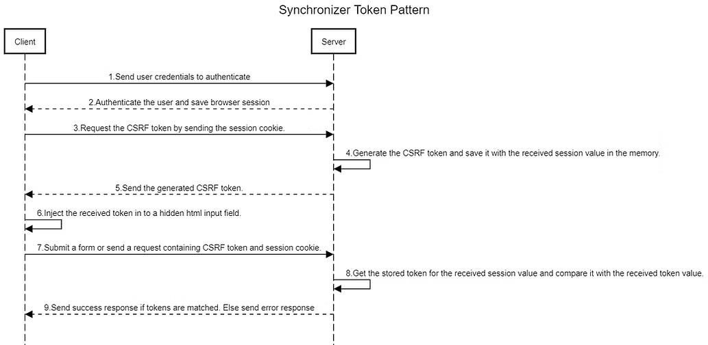
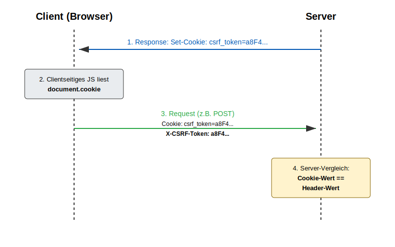

# CSRF Tokens

CSRF-Tokens sind serverseitige Schutzmaßnahmen gegen Cross-Site Request Forgery (CSRF). Der Angriff selbst wird in `02_Sicherheitstechnische_Angriffsvektoren/11_csrf.md` beschrieben.

## Grundprinzip

Jede zustandsändernde Anfrage (POST, PUT, DELETE) muss einen zusätzlichen, kryptografisch zufällig generierten Token enthalten. Dieser Token ist für einen Angreifer nicht vorhersagbar und kann wegen der Same-Origin Policy nicht aus einer fremden Seite heraus ausgelesen werden.

Ein CSRF-Token muss:
- kryptografisch zufällig sein
- ausreichend lang sein (nicht erratbar)
- an die Session oder den Request gebunden sein
- serverseitig validierbar sein

## Synchronizer Token Pattern

Dies ist die klassische Methode.

### Ablauf

1. Benutzer meldet sich an, Server erstellt eine Session
2. Beim Laden eines Formulars erzeugt der Server einen zufälligen Token und speichert ihn in der Session
3. Das Formular enthält den Token als verstecktes Feld
4. Beim Absenden wird der Token mitgesendet
5. Server vergleicht den mitgesendeten Token mit dem Session-Token
6. Nur bei Übereinstimmung wird die Aktion ausgeführt



```html
<form method="POST" action="/transfer">
    <input type="hidden" name="csrf_token" value="a8F4kLm92PqX...">
    <input name="recipient" value="Max Mustermann">
    <input name="amount" value="500">
</form>
```

**Eigenschaften:**
- Hohe Sicherheit durch serverseitige Validierung
- Token kann pro Session oder pro Request generiert werden (Pro-Request: sicherer, komplexer)

## Double-Submit-Cookie

Eine alternative, zustandslose Methode.

### Ablauf

1. Server setzt ein Cookie mit einem zufälligen Token
2. Clientseitiges JavaScript liest diesen Wert aus dem Cookie
3. Token wird zusätzlich als HTTP-Header oder Formularfeld übertragen
4. Server vergleicht Cookie-Wert mit übermitteltem Wert



```
X-CSRF-Token: a8F4kLm92PqX...
```

**Sicherheitsannahme**: Ein Angreifer kann den Cross-Site-Request auslösen (das Cookie wird automatisch mitgesendet), aber er kann wegen der Same-Origin Policy das Cookie nicht auslesen und daher den Header nicht korrekt setzen.

**Voraussetzung**: Subdomains dürfen nicht kompromittiert sein, da sonst ein Angreifer über eine Subdomain ein gültiges Cookie für die Hauptdomain setzen könnte.

**Eigenschaften:**
- Kein serverseitiger Session-Speicher notwendig
- Geeignet für stateless APIs

## Übersicht der CSRF-Schutzmechanismen

| Mechanismus | Schutzwirkung |
|-------------|---------------|
| SameSite-Cookie | Reduziert automatisches Mitsenden von Cookies |
| CORS | Kontrolliert Lesezugriffe zwischen Origins |
| Anti-CSRF-Token | Verhindert Fälschung zustandsändernder Requests |

**Wichtig**: Wenn ein CSRF-Token via XSS auslesbar ist, verliert er seine Schutzwirkung. CSRF-Schutz und XSS-Prävention müssen gemeinsam gedacht werden.

## Prüfungs-Hotspots

- Warum reicht SOP/CORS alleine nicht gegen CSRF?
- Ablauf des Synchronizer Token Patterns erklären
- Unterschied Synchronizer Token Pattern vs. Double-Submit-Cookie
- Welche Requests müssen mit CSRF-Token gesichert werden? (alle zustandsändernden)
