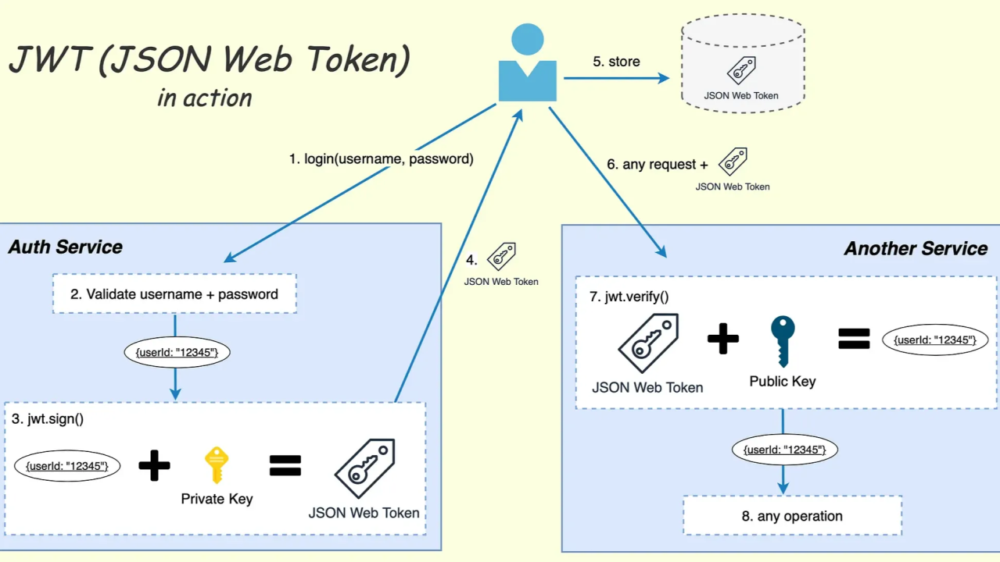

# JWT — JSON Web Token

## Motivation

Das klassische Session-Cookie-Modell erfordert, dass der Server alle aktiven Session IDs speichert (serverseitiger Zustand). In modernen, redundanten Architekturen mit mehreren Servern müssten alle Server diese Tabelle synchron halten — das ist aufwändig. JWT löst das Problem durch einen zustandslosen Token, der alle notwendigen Informationen selbst enthält.

## Aufbau eines JWT

Ein JWT besteht aus drei Base64url-codierten Teilen, getrennt durch Punkte:

```
Header.Payload.Signature
```

Beispiel:

```
eyJhbGciOiJIUzI1NiIsInR5cCI6IkpXVCJ9
.eyJzdWIiOiIxMjM0NTY3ODkwIiwibmFtZSI6IkpvaG4iLCJpYXQiOjE1MTYyMzkwMjJ9
.SflKxwRJSMeKKF2QT4fwpMeJf36POk6yJV_adQssw5c
```

### Header

```json
{
  "alg": "HS256",
  "typ": "JWT"
}
```

Gibt den Signatur-Algorithmus an (z. B. HS256 = HMAC-SHA256, RS256 = RSA-SHA256).

### Payload (Claims)

```json
{
  "sub": "1234567890",
  "name": "John Doe",
  "iat": 1516239022,
  "exp": 1516242622
}
```

Enthält die Nutzdaten (Claims). Wichtige Standard-Claims:

| Claim | Bedeutung |
|-------|-----------|
| `sub` | Subject — wer ist der Benutzer |
| `iat` | Issued At — Ausstellungszeitpunkt |
| `exp` | Expiration Time — Ablaufzeit |
| `iss` | Issuer — wer hat den Token ausgestellt |

### Signature

Der Server signiert Header + Payload mit einem geheimen Schlüssel. Dadurch kann der Server prüfen, ob der Token unverändert ist.

```
HMAC-SHA256(base64url(Header) + "." + base64url(Payload), geheimSchluessel)
```

## Ablauf



1. Benutzer meldet sich an
2. Server prüft Credentials, erstellt JWT und signiert ihn
3. JWT wird an den Client zurückgeschickt (meist im Response Body)
4. Client speichert den JWT (localStorage oder httpOnly-Cookie)
5. Bei jeder weiteren Anfrage sendet der Client den JWT im `Authorization`-Header mit:
   ```
   Authorization: Bearer <token>
   ```
6. Server prüft die Signatur — ist sie gültig, kennt er den Benutzer aus dem Payload (kein Datenbankaufruf nötig)

## Vorteile gegenüber Session-Cookies

- Zustandslos: Server muss nichts speichern
- Funktioniert über Dienst-Grenzen hinweg (Microservices, APIs)
- Enthält Ablaufzeit (`exp`) direkt im Token

## Nachteile und Sicherheitsrisiken

- JWT kann nicht serverseitig invalidiert werden (vor `exp`) — Logout ist schwieriger
- Payload ist nur Base64url-codiert, nicht verschlüsselt — sensible Daten gehören nicht in den Payload
- Schwache Signaturkonfiguration: Algorithmus `none` muss serverseitig abgelehnt werden
- Wenn der geheime Schlüssel schwach ist, kann die Signatur gefälscht werden (Brute Force auf HS256)

## JWT online testen

jwt.io bietet ein Online-Tool zum Dekodieren und Prüfen von JWTs.

## Prüfungs-Hotspots

- Aufbau: Header.Payload.Signature erklären
- Warum ist JWT zustandslos? (Payload enthält alle Infos, Signatur garantiert Integrität)
- Warum sollten keine sensiblen Daten in den Payload? (nur Base64, nicht verschlüsselt)
- Unterschied Session-Cookie vs. JWT
