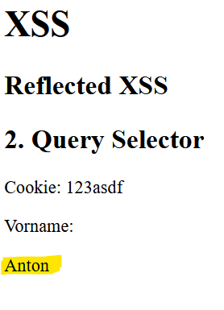
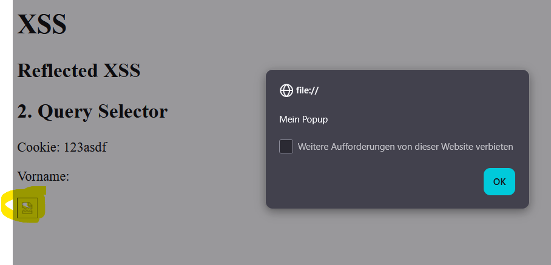

# Reflected XSS

Bei Reflected XSS wird die Payload über einen URL-Parameter eingeschleust. Der Server reflektiert die Eingabe ungefiltert in der HTML-Antwort. Das Opfer führt den Schadcode aus, wenn es auf einen manipulierten Link klickt.

## Ablauf


1. Angreifer erstellt einen Link mit eingebettetem Schadcode als URL-Parameter
2. Angreifer sendet diesen Link an das Opfer (z. B. per E-Mail oder Social Media)
3. Opfer klickt den Link und lädt die Seite
4. Server oder Client-Script reflektiert den Parameter ungefiltert in die Seite
5. Browser führt den Schadcode aus

## Beispiel

Eine Seite liest den URL-Parameter `vorname` und zeigt ihn an:

```javascript
const params = new URLSearchParams(window.location.search);
const val = params.get('vorname');
document.getElementById('vorname').innerHTML = val;
```

Normaler Aufruf:
```
my-site.at/index.html?vorname=Anton
```



### Angriff mit Event-Handler

Da `<script>`-Tags in modernen Browsern blockiert werden, nutzt der Angreifer HTML-Event-Handler:

```
my-site.at/index.html?vorname=
```

Der Browser versucht das Bild zu laden, schlägt fehl und führt `onerror` aus:



## Merkmal: nicht persistent

Die Payload wird nicht serverseitig gespeichert. Der Angriff funktioniert nur, wenn das Opfer auf den manipulierten Link klickt. Bei einem Reload ohne den bösartigen Parameter passiert nichts.

## Hardening

### HTML Escaping

Sonderzeichen in der Ausgabe durch HTML-Entities ersetzen:

| Zeichen | Entity |
|---------|--------|
| `<` | `&lt;` |
| `>` | `&gt;` |
| `"` | `&quot;` |
| `'` | `&#39;` |
| `&` | `&amp;` |

```javascript
function escapeHTML(str) {
    return str.replace(/[&<>"'\/]/g, function(match) {
        return ({ '<': '&lt;', '>': '&gt;', '"': '&quot;',
                  "'": '&#39;', '&': '&amp;', '/': '&#x2F;' })[match];
    });
}
```

### `textContent` statt `innerHTML`

```javascript
document.getElementById('vorname').textContent = val;
```

`textContent` behandelt den Wert immer als Text — nie als HTML.

### DOMPurify

```javascript
let clean = DOMPurify.sanitize(dirty);
```

## Prüfungs-Hotspots

- Wie unterscheidet sich Reflected XSS von Stored XSS? (nicht persistent, Link nötig)
- Warum werden Script-Tags oft geblockt und welche Alternative gibt es? (Event-Handler wie `onerror`)
- Wie schützt `textContent` gegenüber `innerHTML`?
