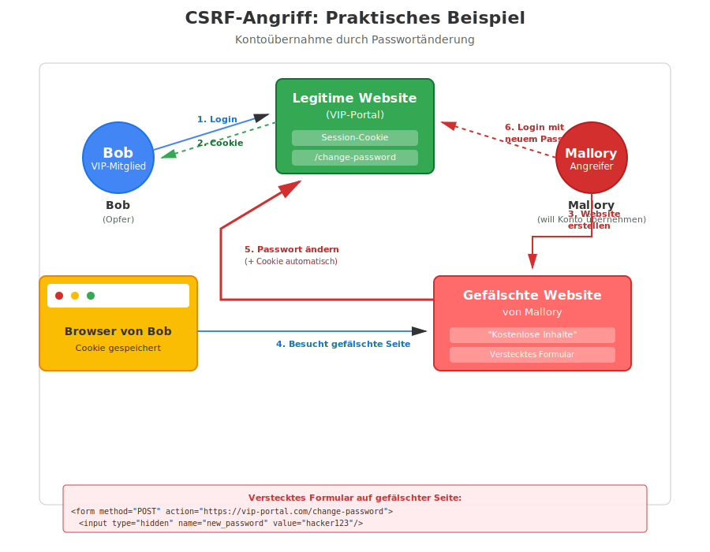

# CSRF — Cross-Site Request Forgery

CSRF ist ein Angriff, bei dem ein Angreifer einen angemeldeten Benutzer dazu bringt, unbeabsichtigt eine Aktion auf einer Webseite auszuführen, bei der er bereits eingeloggt ist.

## Grundprinzip

Browser senden bei jedem Request an eine Domain automatisch alle gespeicherten Cookies mit — unabhängig davon, von welcher Seite der Request ausgelöst wurde.

Ein Angreifer nutzt das aus: Er bringt das Opfer dazu, einen Request an die Zielseite zu senden, der im Namen des Opfers eine Aktion ausführt (z. B. Passwortänderung, Überweisung).

## Technische Voraussetzungen

Für einen erfolgreichen CSRF-Angriff müssen drei Bedingungen erfüllt sein:

1. **Zustandsändernde Operationen**: Die Anwendung erlaubt POST/PUT/DELETE-Requests
2. **Cookie-basierte Authentifizierung**: Identifizierung läuft über Cookies
3. **Vorhersehbare Parameter**: Der Angreifer kann alle Request-Parameter kennen/konstruieren

## Beispiel



1. Bob ist bei `bank.com` eingeloggt (Session-Cookie gesetzt)
2. Mallory erstellt eine bösartige Seite mit einem versteckten Formular:
   ```html
   <form method="POST" action="https://bank.com/transfer">
       <input type="hidden" name="recipient" value="Mallory-Konto">
       <input type="hidden" name="amount" value="10000">
   </form>
   <script>document.forms[0].submit();</script>
   ```
3. Bob besucht Mallorys Seite
4. Das Formular wird automatisch abgesendet — mit Bobs Cookie
5. Die Bank führt die Überweisung aus, da das Cookie gültig ist
6. Mallory hat Bobs Geld erhalten

## Abgrenzung: CSRF vs. XSS

| | CSRF | XSS |
|-|------|-----|
| Angreifer führt aus | Aktion im Namen des Opfers | Code im Browser des Opfers |
| Voraussetzung | Opfer ist eingeloggt | Seite gibt Eingaben ungefiltert aus |
| Schutzmechanismus | CSRF-Token, SameSite-Cookie | Output Encoding, CSP |

## Gegenmaßnahmen (Überblick)

Die detaillierte Beschreibung der CSRF-Token-Mechanismen (Synchronizer Token Pattern, Double-Submit-Cookie) findet sich in [01_Sicherheitstechnische_Methoden/08_csrf_tokens.md](../01_Sicherheitstechnische_Methoden/08_csrf_tokens.md).

### SameSite-Cookie

```
Set-Cookie: session=abc123; SameSite=Strict; Secure
```

- `SameSite=Strict`: Cookie wird nie bei Cross-Site-Requests mitgesendet
- `SameSite=Lax`: Cookie nur bei GET-Navigation mitgesendet (Standard in modernen Browsern)

### Same-Origin Policy (SOP)

Schutzmechanismus des Browsers: Skripte einer Seite dürfen nur auf Ressourcen derselben Origin zugreifen (Protokoll + Host + Port müssen identisch sein).

SOP verhindert, dass Mallory die Antwort von `bank.com` lesen kann — aber nicht das Absenden des Requests selbst. SOP alleine schützt daher nicht vollständig vor CSRF.

### CORS (Cross-Origin Resource Sharing)

Erlaubt einem Server, explizit bestimmte andere Origins zuzulassen. CORS kontrolliert, ob der Browser die Antwort freigibt — verhindert aber nicht das Absenden des Requests. Kein ausreichender CSRF-Schutz alleine.

### CSRF-Token

Die wirksamste Gegenmaßnahme: Jede zustandsändernde Anfrage muss einen nicht vorhersagbaren, an die Session gebundenen Token enthalten. Details: [08_csrf_tokens.md](../01_Sicherheitstechnische_Methoden/08_csrf_tokens.md).

## Prüfungs-Hotspots

- Warum kann der Angreifer den Cookie nicht einfach mitschicken? (er kennt ihn nicht — der Browser sendet ihn automatisch)
- Welche drei Bedingungen müssen für CSRF erfüllt sein?
- Warum schützt SOP/CORS nicht vollständig vor CSRF?
- Was ist der effektivste Schutz? (CSRF-Token + SameSite-Cookie)
