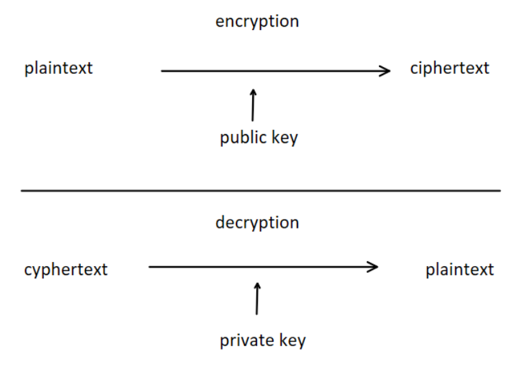
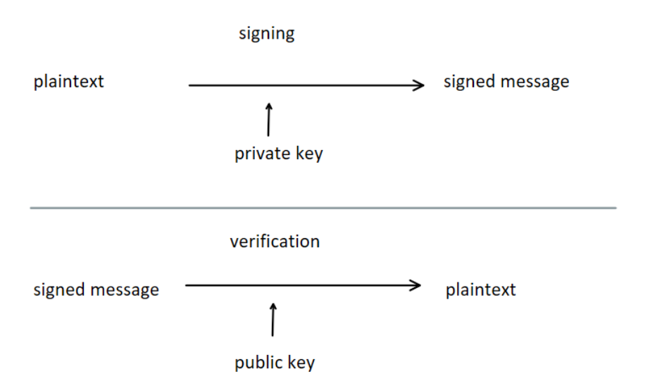

# Asymmetrische Verschlüsselung

Asymmetrische Verschlüsselung ist die Grundlage für sichere Kommunikation im Internet. Sie verwendet ein Schlüsselpaar: einen öffentlichen (Public Key) und einen privaten Schlüssel (Private Key).

Ein TLS/SSL-Zertifikat ist ein digitales Dokument, das die Identität einer Webseite authentifiziert und eine verschlüsselte Verbindung ermöglicht.

## Schlüsselpaar

- **Public Key**: Kann öffentlich bekannt gemacht werden. Jeder darf ihn verwenden.
- **Private Key**: Bleibt geheim beim Besitzer. Darf nie weitergegeben werden.

Die beiden Schlüssel sind mathematisch verknüpft: Was mit dem einen Schlüssel verschlüsselt wird, kann nur mit dem anderen entschlüsselt werden.

## Verschlüsselung (Vertraulichkeit)

Bob möchte eine Nachricht vertraulich an Alice senden:

1. Alice veröffentlicht ihren Public Key
2. Bob verschlüsselt die Nachricht mit Alices Public Key
3. Nur Alice kann sie mit ihrem Private Key entschlüsseln

Da nur Alice den Private Key besitzt, kann auch nur sie die Nachricht lesen.

## Signierung (Authentizität)

Wie kann Alice sicher sein, dass eine Nachricht wirklich von Bob kam?

1. Bob hat ein Schlüsselpaar generiert und seinen Public Key veröffentlicht
2. Bob signiert die Nachricht mit seinem Private Key
3. Alice entschlüsselt die Signatur mit Bobs Public Key
4. Ist das möglich und stimmt der Inhalt, muss die Nachricht von Bob sein

## Vergleich: Verschlüsseln vs. Signieren

| | Verschlüsseln | Signieren |
|-|--------------|----------|
| Schlüssel zum Verschlüsseln | Public Key des Empfängers | Private Key des Absenders |
| Schlüssel zum Entschlüsseln/Prüfen | Private Key des Empfängers | Public Key des Absenders |
| Schutzziel | Vertraulichkeit | Authentizität + Integrität |

## Nachteile

- **Langsamer** als symmetrische Verschlüsselung (rechenintensiv)
- Deshalb: In der Praxis hybride Verschlüsselung — asymmetrisch nur für den Schlüsselaustausch

## Verbreitete Algorithmen

- **RSA**: Klassisch, basiert auf Faktorisierung großer Zahlen. Schlüssellänge: 2048–4096 Bit
- **ECC (Elliptic Curve Cryptography)**: Kürzere Schlüssel bei gleicher Sicherheit, effizienter
- **Diffie-Hellman (DH)**: Schlüsselaustausch ohne direkten Schlüsseltransfer (Perfect Forward Secrecy)

## Prüfungs-Hotspots

- Public Key vs. Private Key: Wer hat was, wer darf was?
- Wozu dient Verschlüsselung, wozu Signierung?
- Warum wird asymmetrische Verschlüsselung nicht für alle Daten verwendet? (zu langsam)
- Was ist hybride Verschlüsselung?
