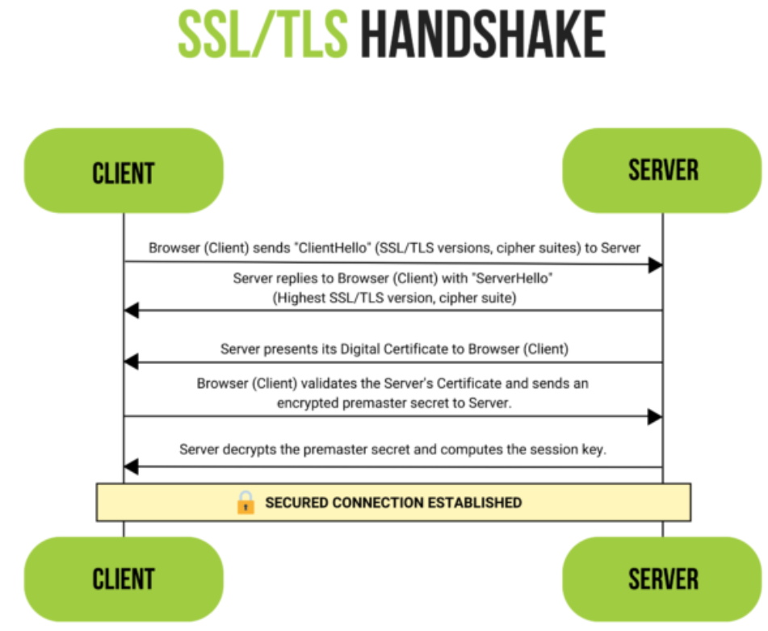

# SSL/TLS

SSL (Secure Socket Layer) und TLS (Transport Layer Security) sind Protokolle zur verschlüsselten Kommunikation über unsichere Netzwerke. Sie werden bei HTTPS, SMTP-Mailservern und vielen anderen Diensten eingesetzt.

## Unterschied SSL vs. TLS

- **SSL**: Ältere Versionen (SSLv2, SSLv3) — alle als unsicher eingestuft und abgekündigt
- **TLS**: Nachfolger von SSL. Aktuelle Version: TLS 1.3 (seit 2018)

"SSL/TLS" ist ein gebräuchlicher Sammelbegriff; technisch korrekt ist heute "TLS".

## TLS-Handshake

Der Handshake baut den verschlüsselten Kanal auf, bevor Daten übertragen werden:

1. **ClientHello**: Client sendet unterstützte TLS-Versionen, Cipher Suites (Verschlüsselungs- und Hash-Algorithmen), zufällige Nonce
2. **ServerHello**: Server wählt die höchste gemeinsam unterstützte Version und Cipher Suite; sendet sein Zertifikat
3. **Zertifikatsprüfung**: Client prüft das Server-Zertifikat über eine Certificate Authority (CA)
4. **Schlüsselaustausch**: Client erzeugt einen `Premaster Secret` und verschlüsselt ihn mit dem Public Key des Servers (RSA) — oder Diffie-Hellman wird verwendet
5. **Session Key**: Beide Seiten berechnen unabhängig voneinander den `Session Key` aus dem `Premaster Secret` + den ausgetauschten Zufallswerten
6. **Finished**: Beide bestätigen, dass der Handshake abgeschlossen ist

Ab diesem Zeitpunkt ist die gesamte Kommunikation **symmetrisch verschlüsselt** mit dem Session Key.

## Warum Premaster Secret?

Der Session Key wird nicht direkt übertragen, sondern aus dem Premaster Secret berechnet. Dadurch:

- Kann ein Angreifer, der den Handshake abhört, den Session Key nicht rekonstruieren
- Bei Diffie-Hellman wird nie der Schlüssel übertragen — MITM-Angriffe sind wirkungslos
- **Perfect Forward Secrecy (PFS)**: Jede Session hat einen neuen Schlüssel — selbst bei einem späteren Leak des Private Keys bleibt die vergangene Kommunikation sicher

## HTTPS im Browser erkennen

HTTPS-Seiten mit gültigem TLS-Zertifikat werden im Browser durch ein Schloss-Symbol angezeigt.

## Schwachstellen und Angriffsszenarien

- Weltweit gibt es hunderte CAs, denen Browser automatisch vertrauen. Jede CA darf Zertifikate für beliebige Domains ausstellen.
- **MITM mit gefälschtem Zertifikat**: Wenn eine CA kompromittiert oder korrumpiert wird (z. B. DigiNotar-Hack 2011), können Angreifer gültige Zertifikate für fremde Domains ausstellen.
- **Certificate Transparency (CT)**: Öffentliches Log aller ausgestellten Zertifikate — ermöglicht Erkennung missbräuchlicher Ausstellungen

## Prüfungs-Hotspots

- Unterschied SSL vs. TLS
- TLS-Handshake-Phasen erklären
- Warum symmetrische Verschlüsselung nach dem Handshake?
- Was ist Perfect Forward Secrecy?
- Welche Schwachstelle gibt es im CA-System?
