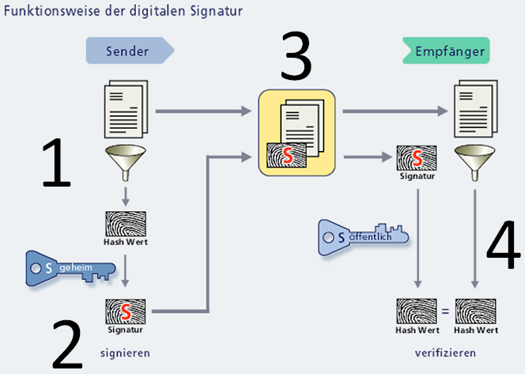

# Digitale Signatur

Eine digitale Signatur verbindet Hashing und asymmetrische Verschlüsselung, um zwei Ziele gleichzeitig zu erreichen:

- **Integrität**: Die Nachricht wurde nicht verändert
- **Authentizität**: Die Nachricht stammt wirklich vom angegebenen Absender

## Ablauf: Signatur erstellen

1. Absender (Bob) hat ein Schlüsselpaar (Public/Private Key)
2. Bob berechnet den Hash der Nachricht (z. B. SHA-256)
3. Bob verschlüsselt den Hash mit seinem **Private Key** → das ist die digitale Signatur
4. Bob sendet Nachricht + Signatur an Empfänger (Alice)

## Ablauf: Signatur prüfen

1. Alice erhält Nachricht + Signatur
2. Alice entschlüsselt die Signatur mit Bobs **Public Key** → erhält den Hash-Wert
3. Alice berechnet selbst den Hash der empfangenen Nachricht
4. Alice vergleicht beide Hash-Werte:
   - Stimmen sie überein: Nachricht ist unverändert und stammt von Bob
   - Stimmen sie nicht überein: Nachricht wurde verändert oder Absender ist nicht Bob

## Grafik

## Warum wird nur der Hash signiert, nicht die ganze Nachricht?

- Asymmetrische Verschlüsselung ist rechenintensiv und langsam
- Hashes haben eine feste, kurze Länge (SHA-256 = 256 Bit) — unabhängig von der Nachrichtengröße
- Effizienter: Nur den kurzen Hash signieren, nicht Megabytes an Daten

## Hash-Algorithmen für Signaturen

| Algorithmus | Ausgabelänge | Sicherheit |
|-------------|-------------|-----------|
| MD5 | 128 Bit | Unsicher (Kollisionen nachgewiesen) |
| SHA-1 | 160 Bit | Unsicher |
| SHA-256 | 256 Bit | Sicher |
| SHA-512 | 512 Bit | Sehr sicher |

## Anwendungsgebiete

- **Softwareverteilung**: Signaturen auf Software-Paketen prüfen, ob sie unverändert vom Hersteller stammen
- **E-Mail** (S/MIME, PGP): Signierte E-Mails garantieren Absender und Unverändertheit
- **Zertifikate**: CAs signieren Zertifikate digital (siehe `10_zertifikate.md`)
- **Code Signing**: Betriebssystem prüft, ob Software signiert ist

## Prüfungs-Hotspots

- Ablauf der Signaturerstellung und -prüfung erklären
- Welcher Schlüssel wird zum Signieren verwendet? (Private Key)
- Welcher Schlüssel wird zum Prüfen verwendet? (Public Key)
- Warum wird der Hash signiert, nicht die ganze Nachricht?
- Was beweist eine gültige Signatur? (Integrität + Authentizität)
