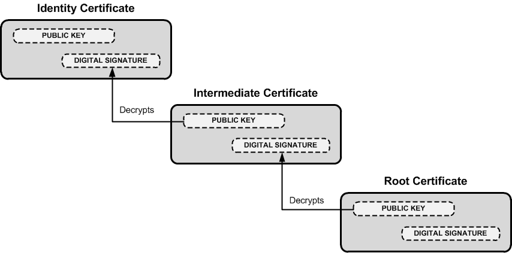

# Zertifikate und PKI

## Das Problem

Bei Public-Key-Verfahren stellt sich die Frage: Woher weiß man, dass ein öffentlicher Schlüssel wirklich zu der angegebenen Person/Domain gehört? Ein Angreifer könnte einen eigenen Schlüssel unter dem Namen einer anderen Domain veröffentlichen.

Lösung: Eine vertrauenswürdige dritte Instanz — die **Certification Authority (CA)** — signiert den öffentlichen Schlüssel und bestätigt damit die Identität.

## PKI — Public Key Infrastructure

Die PKI umfasst alle Komponenten zur Verwaltung und Verteilung öffentlicher Schlüssel:

- Verzeichnis zum Download von Zertifikaten
- Methoden zur Validierung von Zertifikaten
- Methoden zum Widerruf von Zertifikaten (Certificate Revocation List, CRL)

## Rollen im X.509-Standard

| Rolle | Beschreibung |
|-------|-------------|
| **Subscriber** | Betreiber eines Dienstes, der ein Zertifikat benötigt (z. B. Webserver-Betreiber) |
| **Registration Authority (RA)** | Prüft die Identität des Subscribers |
| **Certification Authority (CA)** | Stellt das Zertifikat aus und signiert es |
| **Relying Party** | Vertraut den Zertifikaten (z. B. Webbrowser) |

## Inhalt eines Zertifikats (X.509)

- **Public Key**: Öffentlicher Schlüssel des Subscribers
- **Subject**: FQDN der Domain (z. B. `www.htl-braunau.at`)
- **Issuer**: Welche CA das Zertifikat ausgestellt hat
- **Validity**: Gültigkeitszeitraum (von / bis)
- **Digitale Signatur der CA**: Garantiert Echtheit des Zertifikats

## Identitätsvalidierungsstufen

| Typ | Abkürzung | Was wird geprüft |
|-----|-----------|-----------------|
| Domain Validated | DV | Nur: Ist der Antragsteller Inhaber der Domain? |
| Organisation Validated | OV | Identität der Organisation |
| Individual Validated | IV | Identität einer Person |
| Extended Validation | EV | Umfangreiche Prüfung von Person und Organisation |

## Ausstellungsprozess

1. Subscriber erzeugt ein Schlüsselpaar
2. Subscriber erstellt einen **Certificate Signing Request (CSR)**: enthält Public Key + Infos, signiert mit eigenem Private Key (beweist Besitz des Private Keys)
3. CSR wird bei der RA eingereicht
4. RA prüft Identität, Subordinate CA stellt das Zertifikat aus
5. Zertifikat wird an den Subscriber ausgeliefert

## CA-Hierarchie und Zertifikatskette

CAs sind hierarchisch organisiert:

- **Root CA**: Oberste, vertrauenswürdigste Instanz. Ihr Zertifikat ist selbst-signiert und wird im Browser/OS als Trust Anchor gespeichert
- **Intermediate/Subordinate CA**: Stellt unter Autorität der Root CA Zertifikate aus

Der Subscriber muss die komplette Zertifikatskette bereitstellen (eigenes Zertifikat + alle Intermediate-Zertifikate bis zur Root CA). Der Browser prüft die Kette bis zum bekannten Root Trust Store.

## Schwachstellen

- Weltweit vertrauen Browser hunderten von CAs und deren Unter-CAs
- Jede dieser CAs darf Zertifikate für beliebige Domains ausstellen
- Kompromittierte oder korrumpierte CAs können für MITM-Angriffe missbraucht werden (Beispiel: DigiNotar-Hack 2011, gefälschte Google-Zertifikate durch China)

### Gegenmaßnahme: Certificate Transparency (CT)

Öffentliches, append-only-Log aller ausgestellten Zertifikate. Browser können prüfen, ob ein Zertifikat im CT-Log eingetragen ist. Missbräuchliche Ausstellungen können so erkannt werden.

## Prüfungs-Hotspots

- Was ist eine CA und wozu dient sie?
- PKI-Rollen erklären: Subscriber, RA, CA, Relying Party
- Was ist ein CSR?
- DV vs. OV vs. EV erklären
- Was ist eine Zertifikatskette und warum braucht man sie?
- Schwachstelle im CA-System und Certificate Transparency als Lösung
